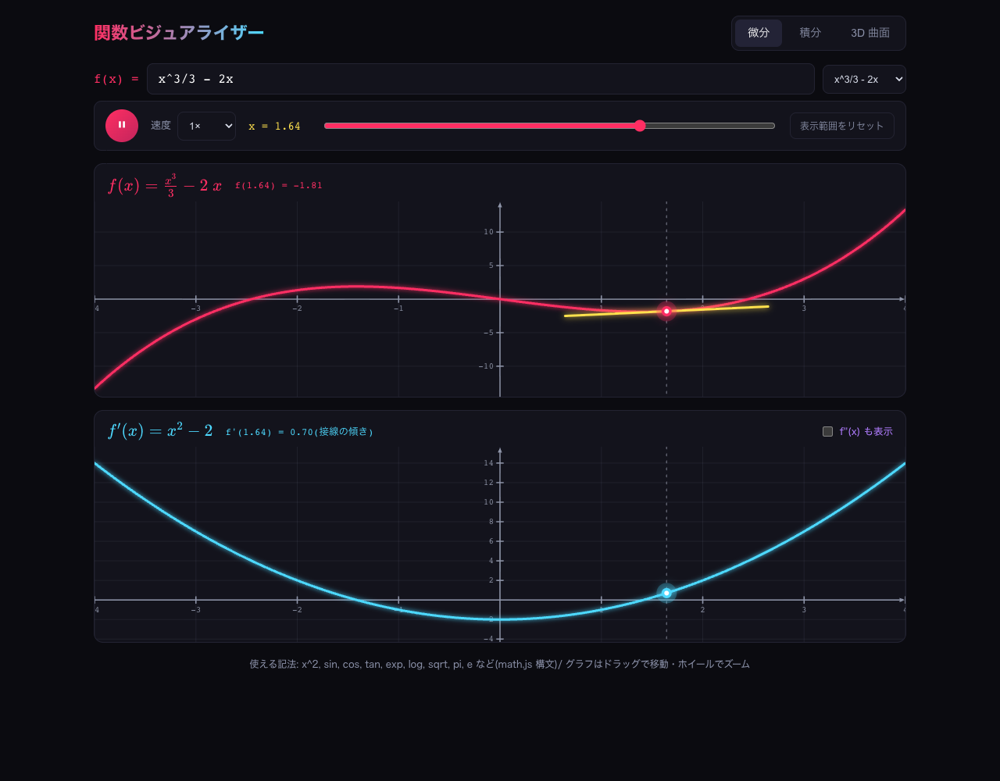

# 関数ビジュアライザー
先日リリースされたFable 5の検証(effortはxhigh)として、
要件定義から実装、ビルド、テスト、デプロイまで一気通貫で本アプリを作成いたしました。

本PJではUIについて、あえて具体的に言及をしていませんでした.
というのも原始関数と導関数の挙動を同時に見る際は、UXの観点から左右よりも上下の方が圧倒的に追いやすいからです。
気になる結果ですが、上下に原始関数・導関数を表示し、X軸の動きに合わせて二つのグラフが同期して動く仕様まで完璧に再現してくれました。




## モード

| モード | 内容 |
|---|---|
| 微分 | f(x) と f'(x) を上下 2 段で同時表示。x が動くと両グラフの点・接線(黄)・破線が連動。f''(x) の重ね表示も可能 |
| 積分 | 面積が累積していくアニメーション + 累積関数 F(x) = ∫ₐˣ f(t)dt のグラフ。下限 a は変更可能。F 上の接線の傾き = f(x)(微積分学の基本定理) |
| 3D 曲面 | z = f(x, y) の曲面。偏微分 ∂f/∂x・∂f/∂y、勾配ベクトル(最急上昇方向)、接平面を表示。点は y = y₀ 上の曲線に沿って移動 |

## 操作

- **関数入力**: math.js 構文(`x^3/3 - 2x`, `sin(x)`, `exp(-x^2/2)` など)。プリセットあり
- **アニメーション**: 再生/停止、速度(0.25×〜4×)、x スライダー
- **2D グラフ**: ドラッグでパン、ホイールでズーム
- **3D グラフ**: ドラッグで回転、ホイールでズーム

## 開発

```bash
npm install
npm run dev      # 開発サーバー
npm test         # 数式エンジンのユニットテスト(Vitest)
npm run build    # 本番ビルド
node scripts/verify.mjs  # ブラウザ動作確認(スクリーンショット生成)
```

## 技術構成

- ビルドツール：Vite
- React + TypeScript
- [math.js](https://mathjs.org/) — 数式パース・記号微分(積分は数値計算: シンプソン則/台形則)
- [KaTeX](https://katex.org/) — 数式表示
- 2D: Canvas 自前レンダラ / 3D: [Three.js](https://threejs.org/)
